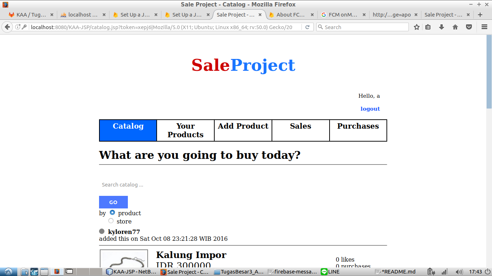
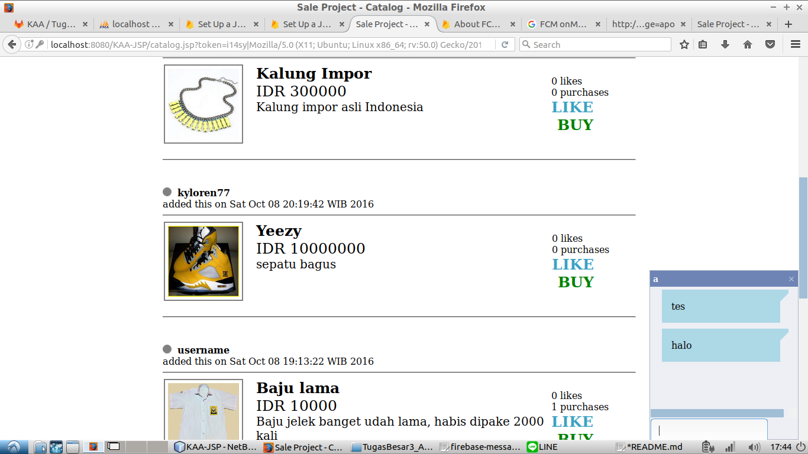

# Tugas 3 IF3110 Pengembangan Aplikasi Berbasis Web

Melakukan upgrade Website Marketplace sederhana pada Tugas 2 dengan mengaplikasikan ***cloud service* (Firebase Cloud Messaging) dan *framework* AngularJS**.

### Tampilan Program
Halaman Catalog

Chatting

### Referensi Terkait
Berikut adalah referensi yang dapat Anda baca terkait tugas ini:
1. https://firebase.google.com/docs/web/setup
2. https://firebase.google.com/docs/cloud-messaging/js/client
3. https://docs.angularjs.org/api

### Pembagian Tugas

Chat app frontend :
1. Fungsionalitas Chatbox: 13514086  
2. Fungsionalitas Controller dan Factory angular: 13514064, 13514080, 13514086  

Chat app backend :  
1. Fungsionalitas ChatService (tokensaver) : 13514064 
1. Fungsionalitas ChatService (retrievestatus) : 13514086  
1. Fungsionalitas ChatService (sendmessage) : 13514064, 13514080  
1. Fungsionalitas ChatService (deletetoken) : 13514080  
2. Fungsionalitas Angular dan firebase : 13514064, 13514080, 13514086  
    
Fitur security (IP, User-agent) :
1. Fungsionalitas User token : 13514080
2. Fungsionalitas Handler : 13514064, 13514086

## About

Kelompok KAA

Kharis | Ali | Azka

Dosen: Yudistira Dwi Wardhana | Riza Satria Perdana
